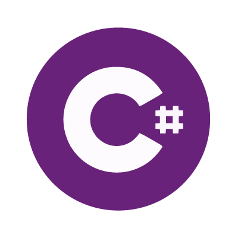
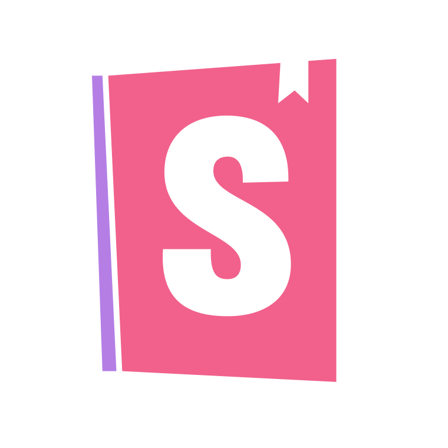

  ### 👋 Hey, I'm Evan.

  

  <strong>Full-Stack Developer in Toronto, ON.</strong>
  
Currently working at
  <a href="https://github.com/klarna" style="display: flex;">@klarna&nbsp;</a>&nbsp; <strong>|</strong> &nbsp; evan.almeidaf@gmail.com

 

  

    <h3 align="center">📚  What I'm currently using:</h3>
    <!-- 
 -->
  

  

     
    
    
    
    
    
    
    
    
    
  

   
   

  

    <h3>🌱  Here's what I'm learning: </h3>
    <!-- 
 -->
  

  

     
    
    
    
    
  

 
 
 

  

